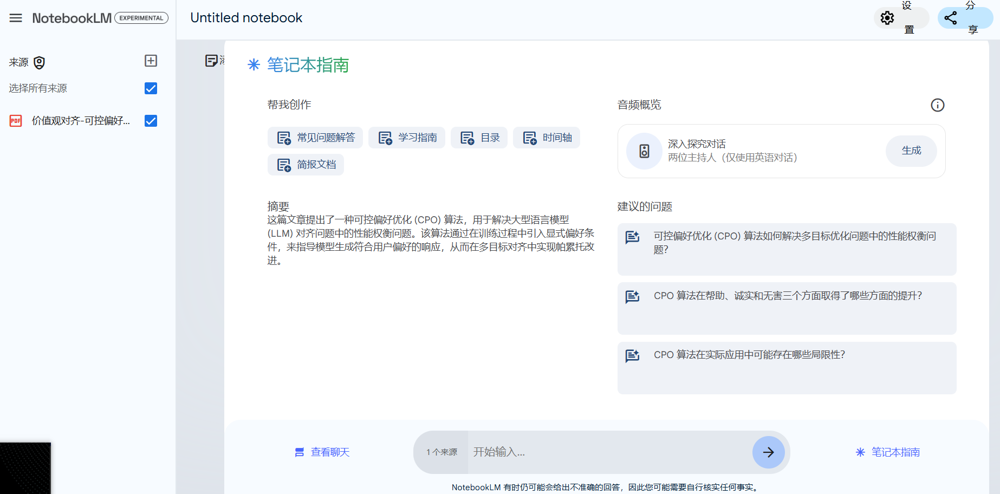
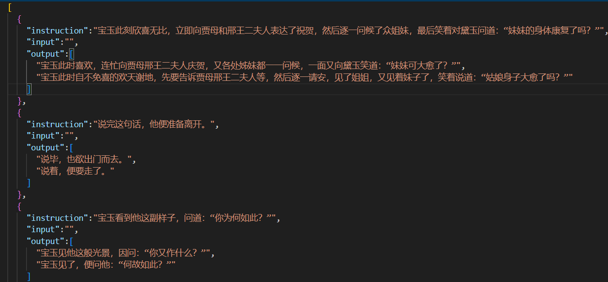
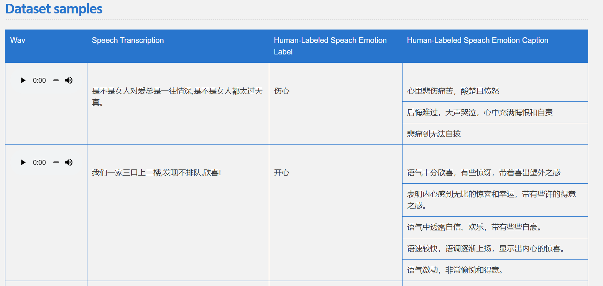
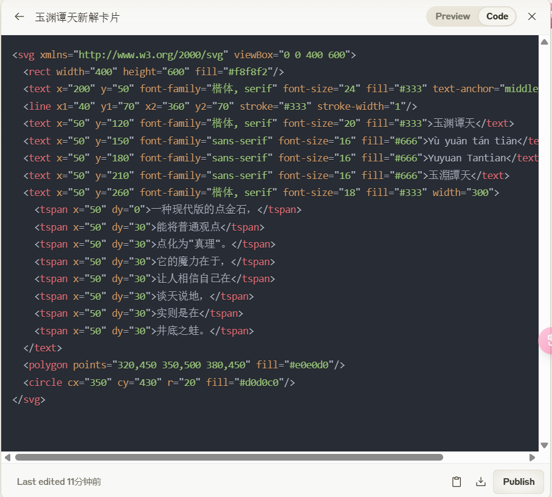
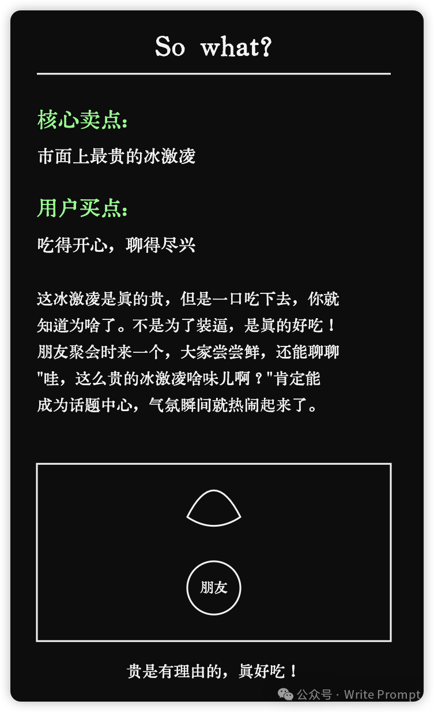
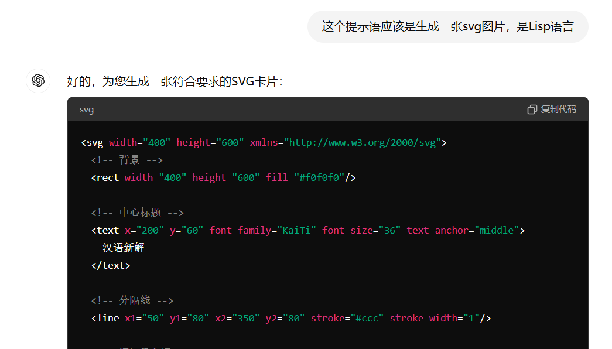
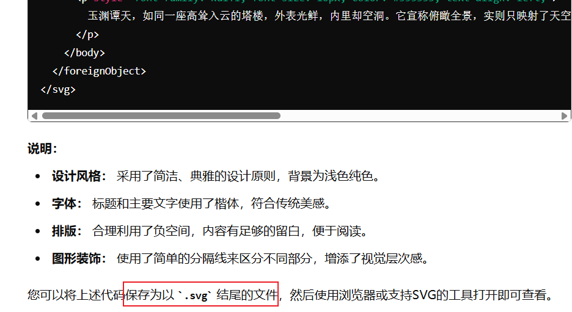

 本文档汇集了截至 📅2024 年 9 月 30 日的前沿技术！围绕“🧐更落地！实践向”“🤯更前沿！理论向”“🤠更新闻！认知向”三大板块，希望带给大家灵感💡

## 🧐 更落地！实践向

***

## 大模型产品形态

### 【NotebookLM】谷歌

https://notebooklm.google/

- 上传文档（PDF、音频、视频、文本）——解释、总结、交互式问答、头脑风暴
- 目前最受关注的功能是生成播客，可以将长篇大论的书籍或论文转变成十分钟左右的音频。
- 相比 ChatGPT，Google gemini 系列模型上下文窗口更大

### 【AskNews】Emergent Methods 开源爱好者团队

研究领域：新闻实体提取/大模型新闻数据/新闻分析

[https://asknews.app/en](https://asknews.app/en)

团队：Emergent Methods 开源爱好者团队（计算机 + 数据分析 + 新闻）

创始人：Robert Caulk，在法国格勒诺布尔阿尔卑斯大学获得计算力学博士学位；透明度研究总监：Elin Törnquist ；系统架构师：Tim Pogue；软件开发/数据分析：Wagner Costa Santos；主编：Steven Caulk。

https://emergentmethods.ai/team.html

【为 LLM 增加新闻上下文-实时】-关联根技术：态势感知

把 AskNews 看作是一个超级强大的向量数据库，可在线使用/调用 api

介绍：[https://emergentmethods.medium.com/infusing-any-llm-with-news-one-line-of-code-86d7f93aabde](https://emergentmethods.medium.com/infusing-any-llm-with-news-one-line-of-code-86d7f93aabde)

体验：[https://asknews.app/en/stories?continent=north_america](https://asknews.app/en/stories?continent=north_america)

每 50 分钟抓取 [5k 个新闻网站](https://asknews.app/en/transparency)（13 种语言，包括 Reddit）；每天**清理**、**总结**、**翻译**和丰富 500k 篇文章；**将文档存储在**不断增长的 Vector 数据库中； 使用最先进的聚类/跟踪方法**随时间跟踪新闻叙述。**

[https://lenbermd.substack.com/p/making-better-sense-of-cognitive](https://lenbermd.substack.com/p/making-better-sense-of-cognitive)

【调用模型的文章图谱构建】-关联根技术

介绍：[https://readmedium.com/en/https:/emergentmethods.medium.com/outperforming-claude-3-5-sonnet-with-phi-3-mini-4k-for-graph-entity-relationship-extraction-tasks-7c8f6c1ebd79](https://readmedium.com/en/https:/emergentmethods.medium.com/outperforming-claude-3-5-sonnet-with-phi-3-mini-4k-for-graph-entity-relationship-extraction-tasks-7c8f6c1ebd79)

体验：[https://huggingface.co/spaces/EmergentMethods/Phi-3-mini-instruct-graph](https://huggingface.co/spaces/EmergentMethods/Phi-3-mini-instruct-graph)

快 + 降低结构错误 + 经济成本降低，Phi-3-mini-4k 是一种功能强大的小语言模型，无法定义特定关系

【新闻实体提取】

模型：[https://huggingface.co/EmergentMethods/gliner_medium_news-v2.1](https://huggingface.co/EmergentMethods/gliner_medium_news-v2.1)

强制执行跨国家/语言/主题/时间的多样性

底座模型：llama2，尽管该数据集的目标是减少偏见并提高多样性，但它仍然偏向于西方语言和国家

### 【StyleLLM 文风转化】开源项目

**【应用】微博文本策略生成、社交语言转化器、传播群组推荐策略**

**stylellm** 是一个基于大语言模型（llm）的文本风格迁移（text style transfer）项目。项目利用大语言模型来学习指定文学作品的写作风格（惯用词汇、句式结构、修辞手法、人物对话等），形成了一系列特定风格的模型。

利用 **stylellm** 模型可将学习到的风格移植至其他通用文本上，即：输入一段原始文本，模型可对其改写，输出带有该风格特色的文本，达到文字修饰、润色或风格模仿的效果。

**stylellm-中国四大名著系列** 包括基于 Yi-6b 微调的四个模型，分别采用《三国演义》、《西游记》、《水浒传》、《红楼梦》四本中国古典长篇小说训练而成，下游做了**风格转化 + 风格化聊天**。

**基座模型：**01.AI 零一万物 [https://github.com/01-ai/Yi?tab=readme-ov-file#what-is-yi](https://github.com/01-ai/Yi?tab=readme-ov-file#what-is-yi)

**训练框架：**LLaMA-Factory** **[https://github.com/hiyouga/LLaMA-Factory](https://github.com/hiyouga/LLaMA-Factory)

**设备需求：**仅文本风格转化运行，量化后的模型占用显存 4.2GB

**测试：**水浒传-鲁智深 Colab 运行 T4 GPU [https://colab.research.google.com/github/stylellm/stylellm_chat/blob/main/colab_web_demo_gradio.ipynb](https://colab.research.google.com/github/stylellm/stylellm_chat/blob/main/colab_web_demo_gradio.ipynb)

**现有大模型对比**

gpt4

**微调语料（开源）**

RM（Reward Model）：人类反馈数据【5k 条/模型  指令-输入-输出 对】

SFT（Supervised Fine-Tuning）：监督微调数据 【2w 条/模型  白话-风格 对】

**Instruction（指令）**：具体任务描述，如，“将现代汉语转换为文言文”

**Input（输入）**：可以为空，也可以包含需要处理的文本。在风格转换任务中，如果不需要额外的上下文信息，这个字段通常是空的。

**Output（输出）**：模型生成结果，一般会有多个，训练模型能够生成符合预期的多样化输出

【应用】微博文本策略生成、社交语言转化器、传播群组推荐策略、角色化智能体

底座技术路径基本走通

问题：是不是**文风**带来的热门/优质？

小鸡词典 / 有梗百科

### 【**SECap 音频分析】清华**

**应用：政治人物舆论情绪点洞察、AI 配音**

提出了一种新的语音情感描述任务（Speech Emotion Captioning, SEC），使用自然语言描述而非单一标签来表征语音情感。SECap 生成的语音情感描述的质量与人类标注者的表现相当。

- 首先，**HuBERT 音频编码器**处理输入的语音信号，提取出语音特征。
- 然后，Bridge-Net（Q-Former）接收这些特征，并使用互信息学习（ STMIL） 和 对比学习（SCCL） 方法进一步处理，以**提取出与情感更紧密相关的特征**，并将其转换成适合文本解码器的格式。
- 最后，**文本解码器（LLaMA）**根据转换后的特征**生成描述语音情感的自然语言句子**。

Demo [https://thuhcsi.github.io/secap_demo/](https://thuhcsi.github.io/secap_demo/)

**训练语料（不开源）**

**训练集：**  5 位女性和 2 位男性说话者，总共 41.6 小时的语音，采样率 24kHz，30526 个句子。（专门为训练和评估 SECap 框架而创建的，不公开）

每个语音样本都有由不同标注者提供的三个到五个人类标注的语音情感描述，以及相应的情感标签。每个语音样本还有对应的转录文本。

1. 情感标注过程：

   - 使用单个词识别整体情感。
   - 描述情感的强度。
   - 提供一个综合句子，考虑情感、音量和语速。
2. 标注质量控制：为了确保标注质量，研究团队随机选择每 100 个剪辑中的 5 个进行其他标注者的复审，以保持高标准。
3. 数据集划分：在构建完 EMOSpeech 数据集后，研究团队随机选择了 600 个句子用于测试，600 个句子用于验证，其余的 29326 个句子用于训练。

**测试集： **600 个测试数据集

`wav`：WAV 音频文件；`text.txt`：音频文件的转录；`fid2captions.json`：音频文件的情感字幕。

**项目运行条件**

开源情况：提供<u>预训练模型、权重、预训练检查点</u> 30+G，需要安装依赖 240+

运行条件：40G V100 ， 16 位混合精度进行训练，使用 float32 进行推理。

处理由 600 个句子组成的整个测试集，8 台 40G V100 上花了 10 分钟。

模型需要单声道（单声道）输入

其他相关项目：[https://github.com/Renovamen/Speech-Emotion-Recognition](https://github.com/Renovamen/Speech-Emotion-Recognition)

### 【MetaGPT 多智能体框架】

**MetaGPT**** **多智能体框架-将不同的角色分配给 GPT 模型，形成一个协作性软件公司-类似 autoGPT

### 【智能体】-总结

什么是智能体？

感知端（Perception）、控制端（Brain）、行动端（Action）、再学习？

**Perception** 文本输入、视觉输入、听觉输入、环境感知（激光雷达、GPS、温度等）

**Brain **自然语言交互、知识、记忆、推理规划、迁移泛化

**Action **文本输出、工具使用、具身行动

例子：当人类询问是否会下雨时，感知端（Perception）将指令转换为 LLMs 可以理解的表示。然后控制端（Brain）开始根据当前天气和互联网上的天气预报进行推理和行动规划。最后，行动端（Action）做出响应并将雨伞递给人类。

智能体的分类

1、**单代理：任务导向**、创新导向、生命周期导向（开放世界探索）

2、多代理：**合作互动**（无序合作、**有序合作**）、对抗互动  <u>Agentic Workflow</u>

3、模拟社会

如何与我们现在的根技术相结合？

一个统领，调用各个根技术（智能体）

## 大模型使用技巧

### 【汉语新解】**李继刚**

Claude 自我对抗 (Self-Play) 的强化学习训练框架

体验：https://texthuman.ai/

**LISP 语言**

> 1. `新汉语老师` 函数: 这个函数定义了一个角色，扮演一个年轻、批判现实、思考深刻且语言风趣的老师。它的风格受到王尔德、鲁迅和林语堂的影响，擅长一针见血的表达，使用隐喻，并以讽刺幽默的方式进行批评。
> 2. `汉语新解` 函数: 这是主要函数，接受用户输入的词汇，然后用特殊视角解释它。它通过一系列处理步骤（如抓住本质、辛辣讽刺、一针见血、隐喻等）来生成解释，最后创建一个 SVG 卡片来展示结果。
> 3. `SVG-Card` 函数: 这个函数负责生成一个 SVG 格式的卡片，用于展示解释结果。它设置了卡片的设计规则，包括尺寸、字体、配色等，以确保输出的卡片美观且富有设计感。
> 4. `start` 函数: 这是程序的启动函数，它设置系统角色并打印一条欢迎消息。
> 5. 运行规则: 代码最后指出了运行程序的步骤：先运行 `(start)` 函数，然后使用 `(汉语新解 用户输入)` 来处理用户输入的词汇。
>    

**李继刚背景**

微信号：jznhljg

github 主页：[https://github.com/lijigang](https://github.com/lijigang)

个人公众号：Write Prompt

*关联社区 【LangGPT-国内最大的提示工程社区】[⭐ 结构化提示词](https://langgptai.feishu.cn/wiki/RXdbwRyASiShtDky381ciwFEnpe)

### 【更多 Claude Prompt】**李继刚**

[https://mp.weixin.qq.com/s/2TEQN9PtIt4H4o1taNTrOg](https://mp.weixin.qq.com/s/2TEQN9PtIt4H4o1taNTrOg)

### 【微调 or 多步处理】-总结

**先创意再规范 先生成再判断**

- 使用大语言模型时，直接通过微调模型来生成特定格式的数据通常会面临高成本和复杂性。而分成两个步骤的处理方式往往能以更低的成本实现更优的效果。

1. JSON 格式化输出
   强制要求模型直接生成标准格式会削弱模型的推理和理解能力。为了保证输出格式正确我们必须降低温度，然而在实际工作中，我们又需要依靠高温带来的随机性提供创意内容。

**方案**：使用两步法来生成 JSON 内容：

- **自由生成**：让模型先以没有任何格式限制的自由方式进行内容生成，这样可以发挥模型的推理能力，产生更丰富、更准确的内容。
- **格式化处理**：将生成的自由内容转换成所需的 JSON 格式，确保输出符合要求。

1. 验证器
   希望获得准确且高质量的答案，但通过微调模型来产生这些答案需要大量成本，而且存在过拟合的风险。

**方案**：引入验证器，采用两步法来提升答案的准确性：

1. **生成多种答案**：让模型生成多个可能的答案，而不强制它只生成一个“正确”的答案。
2. **验证器筛选**：使用验证器在生成的多个答案中挑选最优的一个，确保最终输出的准确性，避免错误累积。

### 【prompt 小技巧】-总结

- 使用 XML 格式（例如 `<instructions>`、`<example>` 和 `<formatting>`）来分割提示词的不同部分，避免将指令和示例文本混淆。
- JSON 和 Markdown 也是有效的提示格式

## 大模型研发

### 【OpenAI o1】OpenAI

[https://openai.com/index/introducing-openai-o1-preview/](https://openai.com/index/introducing-openai-o1-preview/)

o1-preview 的**每周**速率限制为 30 条消息，o1-mini 为 50 条消息

o1 在 STEM（理工科）领域进行了特别优化，在回答之前会<u>进行思考</u>。在<u>物理、生物和化学</u>问题（GPQA）的基准测试中超越了人类博士水平的准确性

不支持多模态，不支持联网

价格高，o1 的价格是 4o 的 6 倍，o1 计费并不按最终输出，其中间<u>思考过程</u>所消耗的 token，并被视作 output tokens，这意味着 100 tokens 的内容输出，可能会被按 10000 tokens 计费

思维链封装

### **【端侧视频理解 MiniCPM】面壁智能**

他这个逻辑是一秒抽一帧出来一起理解，然后串联起来之后看前后图之间有不有关系，基本到 1 分钟的视频就极限了，64 帧。如果再多就会偷懒随便抽几帧来看

MiniCPM-V 2.6 推理结果：

片段 1

The video presents a diverse and dynamic portrayal of international exchange programs, particularly focusing on the experiences of young participants in China. It begins with a close-up of a person's hands operating an electronic device, suggesting technological engagement or communication. Transitioning to broader scenes, the video showcases a tram decorated with colorful advertisements, indicating a lively urban environment. The narrative then shifts to a group of individuals wearing matching white T-shirts, signifying unity and purpose, as they explore historical sites like the Forbidden City, emphasizing cultural immersion through guided tours. Further clips depict these groups interacting in community settings, engaging in discussions, and reflecting on their experiences, highlighting themes of friendship, learning, and mutual understanding. The presence of cameras suggests media coverage or documentation of these events. A significant segment features a man speaking about his observations and insights during the program, adding a reflective dimension to the content. This is followed by scenes capturing the joyous interactions among participants at iconic landmarks such as the Great Wall, reinforcing the positive impact of cross-cultural exchanges. Concluding with promotional graphics, the video emphasizes the broader implications of these programs, questioning what foreigners come to see in China and positioning it as a platform for simple logic to understand complex realities. The branding "开谭了" (Kāitán le) and its English translation suggest a focus on insightful conversations or dialogues arising from these experiences.

该视频呈现了国际交流项目的多样化和动态描绘，特别关注中国年轻参与者的经历。它以一个人的手操作电子设备的特写开始，暗示着技术参与或交流。过渡到更广泛的场景，视频展示了装饰有彩色广告的有轨电车，表明了一个充满活力的城市环境。然后叙述转向一群穿着相配白色 T 恤的个人，象征着团结和目的，他们探索故宫等历史遗址，通过导游强调文化沉浸。进一步的片段描绘了这些团体在社区环境中互动，参与讨论，并反思他们的经历，突出友谊，学习和相互理解的主题。摄像机的存在表明媒体报道或留档这些事件。一个重要的片段是一个男人在节目中讲述他的观察和见解，为内容增添了反思的维度。接下来是捕捉参与者在标志性地标（如长城）之间愉快互动的场景，强化了跨文化交流的积极影响。视频以宣传图形结束，强调了这些节目的更广泛影响，质疑外国人在中国看到的东西，并将其定位为理解复杂现实的简单逻辑平台。品牌“开谭了”（Kāitán le）及其英文翻译表明，重点关注这些经历所产生的有见地的对话或对话。

片段 2

The video begins with a scene featuring an assortment of film strips, some displaying clear images and others appearing blurry or damaged. The setting transitions to a globe on a desk surrounded by more film strips, indicating a workspace related to media or photography. This is followed by a computer screen displaying data graphs, suggesting the analysis of film-related metrics. The narrative progresses as hands are seen sorting through the film rolls, organizing them in a systematic manner. The focus shifts to a large display of circular patterns, possibly representing data visualizations, with the word "GOOD" prominently displayed across several frames. The patterns evolve from simple to complex designs, hinting at a thematic exploration of concepts like quality or satisfaction. Subsequently, the video introduces various settings such as a supermarket, city streets, parks, and an airport, showcasing people interacting with their environments. These scenes highlight moments of discovery, social interaction, and travel, interspersed with text overlays that provide context or commentary. Towards the end, the video revisits the workspace where individuals engage with digital tablets, likely analyzing or managing content. The consistent theme throughout the video revolves around the collection, organization, and interpretation of media, both physical (film) and digital, emphasizing the process behind creating and understanding visual narratives.
视频以一个场景开始，其中包括各种胶片条，一些显示清晰的图像，而另一些则显得模糊或损坏。场景过渡到桌子上的地球仪，周围环绕着更多的胶片条，表明与媒体或摄影相关的工作空间。随后是一个显示数据图表的计算机屏幕，建议分析与电影相关的指标。故事情节随着手被看到整理胶片卷，以系统的方式组织它们而进行。焦点转移到大量圆形图案的显示，可能代表数据可视化，单词“GOOD”在几个帧中突出显示。这些图案从简单到复杂的设计演变，暗示着对质量或满意度等概念的主题探索。随后，视频介绍了各种场景，如超市、城市街道、公园和机场，展示了人们与环境的互动。这些场景突出了发现、社交互动和旅行的时刻，夹杂着提供上下文或评论的文本叠加。在最后，视频重新审视了个人使用数字平板电脑进行分析或管理内容的工作空间。整个视频的一致主题围绕着媒体的收集、组织和解释，包括物理（电影）和数字，强调了创建和理解视觉叙事背后的过程。

片段 3

The video begins with a blurred background featuring indistinct images of people, overlaid with Chinese text and a logo in the top left corner. The initial focus is on discussing trends in social media discussions about China's model, as indicated by a graph displaying fluctuating data points over time. As the video progresses, it transitions to show excerpts from online posts that express differing opinions about international perceptions of China. Subsequently, the video presents a pie chart summarizing the main topics of discussion related to learning from China across various social media platforms this year. The chart shows that 36% of the discussions revolve around technological industries and manufacturing support, while other significant areas include infrastructure investment (21%), centralization of power (21%), environmental investments (7%), and general advancements (22%). Throughout the video, additional text appears at the bottom, providing context and insights into these discussions, such as mentioning specific concerns or points of interest among countries studying China. The overall narrative suggests an analysis of global engagement with China's development strategies through social media discourse.
视频以模糊的背景开始，背景上有不清晰的人物图像，左上角覆盖着中文文本和标志。最初的重点是讨论有关中国模式的社交媒体讨论趋势，如显示随时间波动的数据点的图表所示。随着视频的进行，它过渡到显示在线帖子的摘录，这些帖子表达了对国际对中国看法的不同看法。随后，视频呈现了一个饼图，总结了今年在各种社交媒体平台上与向中国学习相关的主要讨论主题。图表显示，36% 的讨论围绕技术产业和制造业支持展开，而其他重要领域包括基础设施投资（21%），权力集中（21%），环境投资（7%）和一般进步（22%）。在整个视频中，底部出现了额外的文本，提供了这些讨论的背景和见解，例如提到研究中国的国家的具体关切或兴趣点。总体叙述表明通过社交媒体话语分析全球参与中国发展战略的情况。

片段 4

The video begins with a group of students, dressed in white and dark uniforms, waving goodbye as they stand on the steps outside a building. The setting appears to be an educational institution, possibly at the end of a school day or a special event. As the camera pans right, it reveals more students joining the scene, indicating that this farewell is well-attended. The perspective then shifts inside a bus, where passengers are seen looking out the window, capturing the moment from their vantage point. The focus transitions back outdoors, showing the group of students still waving, now with a clear view of a modern building in the background. A person is seen holding up a smartphone, likely recording the send-off. The narrative continues with close-up shots of individuals speaking into microphones, suggesting speeches or interviews taking place within the context of the farewell. One individual, identified by a lanyard with text, discusses themes of hope and dreams, hinting at personal reflections or shared sentiments among participants. The scenery changes to iconic landmarks such as a bridge over a river and the Great Wall, indicating that the trip involves sightseeing and cultural exploration. These scenes capture moments of awe and appreciation for the surroundings, with one individual expressing gratitude for these experiences. The video concludes with a symbolic representation using a vintage camera and film strips, metaphorically illustrating the act of documenting memories and the journey's impact on the participants. This imagery underscores the idea that travel enriches personal perspectives and fosters a deeper connection with the world.
视频开始时，一群身穿白色和深色制服的学生站在建筑物外的台阶上挥手告别。场景似乎是一所教育机构，可能是在放学或特殊活动结束时。当摄像机向右移动时，它揭示了更多的学生加入场景，表明这次告别活动得到了很好的参与。然后，视角在公交车内转移，乘客们被看到从窗户望出去，从他们的视角捕捉这一时刻。焦点转移到户外，显示学生们仍在挥手，现在背景中清晰地看到了一座现代建筑。一个人被看到拿着智能手机，可能正在记录送别。故事继续以个人对着麦克风讲话的特写镜头，暗示演讲或采访是在告别的背景下进行的。一个人被一条带有文字的挂绳识别，讨论希望和梦想的主题，暗示着参与者之间的个人反思或共同情感。风景变成了标志性的地标，如河上的桥梁和长城，表明旅行涉及观光和文化探索。这些场景捕捉了对周围环境的敬畏和欣赏的时刻，其中一个人表达了对这些经历的感激之情。视频以象征性的表现结束，使用老式相机和胶片，隐喻性地说明了记录记忆和旅程对参与者的影响的行为。这种图像强调了旅行丰富了个人视角并促进了与世界更深层次的联系的想法。

**情感：**

The video conveys a sense of farewell and nostalgia as the students wave goodbye to their departing bus.

视频传达了一种告别和怀旧的感觉，学生们向他们即将离开的巴士挥手告别。

**字幕提取能力：**

根据提供的视频内容和截图，以下是从视频中提取的字幕： 1. 我想起在跟着“旅行团”旅程的最后 2. 看到的感动一幕 3. 他的话 4. 大巴车外美国高中生们 5. 他说的那些“希望和梦想” 6. 所以“China Travel”的爆火 7. 从来没有一场突如其来的热潮那样简单 8. 它的成功也让我想起了哈尔滨和淄博的“出圈” 9. 当我们越来越坚定地走自己的路时 10. 会发现我们也越来越打动着世界

这些字幕反映了视频中的情感和主题，包括对旅程的回忆、感动时刻、以及对未来的希望和梦想。

**划分场景并描述：**

这段视频展示了一群学生在学校外的场景，他们穿着统一的校服，似乎在进行某种集体活动。以下是对各个场景的详细描述： 1. **学校外的场景**：   - 学生们排成一列，面向建筑物，举起手臂，像是在挥手告别。   - 有学生在用手机拍摄这一幕。 2. **车内场景**：   - 学生们坐在大巴车上，通过车窗向外看，挥手与外面的人告别。   - 车窗外可以看到学校建筑和楼梯。 3. **车内互动**：   - 学生们在车内相互交流，有的人在拍照，有的人在看向窗外。 4. **采访环节**：   - 一名学生站在带有“友谊”字样的背景板前接受采访，手持麦克风。   - 另一位学生也在类似的背景下讲话。 5. **旅行中的风景**：   - 通过车窗看到的城市风光，包括桥梁和高楼大厦。 6. **复古相机展示**：   - 展示了一台老式双镜头相机，强调其在记录生活中的重要性。 7. **文字叠加**：   - 出现了“China Travel”的字样，暗示视频的主题可能与旅游相关。 8. **黑白画面**：   - 黑白画面中出现了“you ag”字样，可能是为了突出某个主题或情感。 这些场景共同描绘了一个学生旅行团的告别时刻，以及他们在旅途中所经历的情感和回忆。

黑白画面中出现了“you ag”字样——说明抽取了这一帧

### 【ControlNeXt 骨骼控制】

升级版 ControlNet。给文生图和文生视频模型增加除文本外的控制条件，如果人体骨架图。

可以支持控制视频中人物的动作。模型已开源。

[https://github.com/dvlab-research/ControlNeXt](https://github.com/dvlab-research/ControlNeXt)

特点

- 支持多个基础模型：SD1.5, SDXL, SD3, SVD. 其中前三个是文生图模型，SVD 是图生视频模型
- 模型参数和代码已经开源
- 模型的参数量是 ControlNet 的三分之二左右，需要的算力更少
- 国产

演示链接：

[https://pbihao.github.io/projects/controlnext/index.html#text-guided](https://pbihao.github.io/projects/controlnext/index.html#text-guided)

### 【视觉分割 SAM2-虚假检测】Meta

[https://github.com/facebookresearch/segment-anything-2](https://github.com/facebookresearch/segment-anything-2)

2023 年，Meta 首次开源了视觉分割模型 SAM，能够根据交互和自动化两种方式任意切割视频、图像中的所有元素，当时这个模型被誉为计算机视觉界的“ChatGPT 时刻”。

相比于之前 Meta 之前发布的 SAM，SAM2 可以看做是从图像到视频领域的推广。**SAM2 能够实时分割静态图像和动态视频内容中的任何对象**，即使模型之前未曾见过这些对象。为未来的各种应用场景，如混合现实、视频编辑等提供了强大的技术支持。SAM 2 的架构采用了创新的流式内存设计，使得它非常**适合实时应用，并且能够在图像分割准确率和视频分割性能上超越现有技术。**

同时 Meta 还分享了 SAM-2 的训练数据集 SA-V，包含了 51,000 真实世界视频和超过 600,000 个时空遮罩，这比其他同类数据集大 50 倍左右，可帮助开发人员构建更好的视觉模型。

使用 SAM2 能够将视频中的物体抠出来，并且跟踪这个物体应用创意效果。

SAM2 支持选择任何视频帧中的对象，应用各种创意的场景，或许能够赋能视频号产品创作，提升视频剪辑效率，丰富视觉效果。

————

image manipulation detection

demo：[https://huggingface.co/spaces/DFisch/Image-Manipulation-Detection](https://huggingface.co/spaces/DFisch/Image-Manipulation-Detection)

方法：DF-Net: The Digital Forensics Network for Image Forgery Detection

输入图像：

图像编辑检测结果：

【（黑--白）白色亮度越高表示被编辑的概率越高】当前检测结果包括人像区域（画面中部）、图像水印区域（左下角），浮标区域（右侧中部），推测对人像区域进行了磨皮、调色操作，白色亮度越高表示被编辑的概率越高。

过程：

右是用美联社的图，但是这张和上一张好像不一样

### 【**ReHiFace-S 换脸】硅基智能**

全称“Real Time High-Fidelity Faceswap”，硅基智能打造，只需一张图片无需任何数据训练和复杂的配置，就可以实现高保真、实时人脸替换的神奇算法，项目完全开源，免费提供所有代码和预训练模型，还支持用户自由定制和扩展。

原网址：<u>[https://github.com/GuijiAI/ReHiFace-S](https://github.com/GuijiAI/ReHiFace-S)</u>

（但是因为涉及到换脸安全问题目前项目删库了，只有整合包或者夸克网盘下载）

整合包：<u>[https://deepface.cc/thread-335-1-1.html](https://deepface.cc/thread-335-1-1.html)</u>

夸克网盘：<u>[https://pan.quark.cn/s/f2043d397713](https://pan.quark.cn/s/f2043d397713)</u>

**特点**

- 多目标人脸替换

可应用于直播和视频通话等场景，支持摄像头捕捉并实时替换多个目标人脸。

- 神经网络预测与重建高分辨率细节

通过深度学习和神经网络模型提升视频分辨率，模型可以预测和回复低分辨率画面中的细节，使其达到更高的视觉质量。

- 色彩矫正

确保源脸和目标图像之间的色调和光照一致，避免视觉上的突兀。

- 一键快速部署

提供简化的安装和配置流程。

- 提供 Gradio 交互界面

用户可以在浏览器中直接进行操作，无需编写代码。

- 支持 ONNX

允许在不同的硬件平台和深度学习框架之间轻松转换和部署。

- 更好的人脸分割模型

基于大量数据重新微调训练 XsegNet 以获得更好的人脸分割效果，支持大部分人脸遮挡时的分割，包括但不限于眼镜以及手等遮挡。

演示链接：

【ReHiFace-S 一款集高保真、实时性、易用性于一身的视频换脸神器 附效果视频演示】[https://www.bilibili.com/video/BV1VWsxeSEmJ?vd_source=41ce7a4583eb8de63822391dbfbd1443](https://www.bilibili.com/video/BV1VWsxeSEmJ?vd_source=41ce7a4583eb8de63822391dbfbd1443)

【ReHiFace-S：硅基智能开源的实时换脸项目】[https://www.bilibili.com/video/BV1M4WmePEQZ?vd_source=41ce7a4583eb8de63822391dbfbd1443](https://www.bilibili.com/video/BV1M4WmePEQZ?vd_source=41ce7a4583eb8de63822391dbfbd1443)

## 其他工具

### 【greppo 地图可视化】开源框架

GitHub 上的开源 Python 框架，可快速搭建一款可交互式的地理空间应用，提供了一整套完整工具包，可以打通数据、算法、可视化 UI 等模块，构建一款交互式应用。

储存库：[https://github.com/greppo-io/greppo](https://github.com/greppo-io/greppo)

文档：[https://docs.greppo.io/](https://docs.greppo.io/)

网站：[https://greppo.io/](https://greppo.io/)

**亮点**

- 数据整合和处理

可以从地理信息系统（GIS）、传感器、数据库种整合数据源，提供统一的数据接口供应用程序使用。

- 地理空间分析

它提供了各种地理空间分析算法和工具，能够对地理数据进行空间查询、缓冲区分析、叠加分析等操作。可以使用 Greppo 的 API 和函数库来执行复杂的地理空间计算和处理任务，从而获得有关地理位置、距离、区域和空间关系的洞察。

- 可视化和用户界面

可以在可视化库创建各种地图、图表和仪表盘，以便更好地理解和呈现地理空间数据。Greppo 还支持用户与应用程序进行实时交互，并进行数据查询、过滤和操作。

### 【**tapd 团队协同】腾讯**

**应用：项目管理、协同开发**

项目研发全流程管理

### 【**memotrace 留痕 - 微信分析】**

**应用：智能体创建、经验数据转化**

导出微信信息、分析统计、AI 对话

**导出信息**

- 导出人员信息

  - 联系人：微信号、昵称、备注、性别、地区、签名、标签、电话
  - 群聊成员：微信号、昵称、备注、性别、地区
- 导出聊天记录

  - TXT：支持的消息类型：文本、转账、分享的卡片链接、语音、转账、音视频通话记录、合并转发的聊天记录、引用消息、名片分享、小程序、视频号
  - docx：支持的消息类型：文本
  - csv：原数据库数据直出（未解析）
  - xlsx：字段：消息 ID、类型、发送人、内容、备注、昵称
    - 文本、图片、位置分享、分享的卡片链接、引用消息、名片分享、转账、音视频通话记录、小程序、视频号
    - 语音、视频、文件都是以超链接的形式加到内容里，图片嵌入到单元格里
  - JSON：支持模型微调

**统计分析**

**AI 对话**

文件对话 + 知识库问答 +LLM 对话

### **【Chat2DB 数据统筹】**

**Chat2DB**** **AI 驱动的数据统筹管理-支持 Mysql、Postgresql、SQLServer、DB2、 Oracle、SQLServer、Oceanbase、Clickhouse、Redis、H2、SQLite、达梦、人大金仓等多种数据库，可以实现自然语言和 SQL 的互相转化-个人 799 永久；团队 1495/年/5 人-可私有化部署

## 🤯 更前沿！理论向
***

## 大模型心智测评

### 【大模型社交智能评测】清华

交互式人工智能（CoAI）课题组，由朱小燕、黄民烈指导，课题组现有博士生、硕士生 10 余人，访问学生 10 余人。

[https://coai.cs.tsinghua.edu.cn/](https://coai.cs.tsinghua.edu.cn/)

ToMBench 是一个全面衡量大模型心智理论（Theory of Mind，ToM）能力的基准测试框架，以专业心理学理论为基础，涵盖了 **8 种公认的 ToM 任务和 31 种核心 ToM 能力**，采用多项选择问题格式，并且从零构建了 2,860 个原创双语(中英)测试样本，涵盖多样的真实社交情境。每个维度构建**单选题**，评测时采用 zero-shot 生成方式，从生成结果中**抽取答案与真实答案做比较**。模型各维度得分为回答正确的题目所占百分比，任务维度和能力维度的最终得分均为各个维度得分的平均值。针对拒答现象，将拒答题目视为回答错误。

EmoBench 是一个全面衡量大模型情商的基准测试框架，数据集由 **400 个精心设计的单选题组成**，能够全面评估大模型情绪理解和情绪应用两方面能力。

### 【多模态心智测评 】纽约大学、哈佛大学、麻省理工等

[https://chuanyangjin.com/mmtom-qa](https://chuanyangjin.com/mmtom-qa)

首个多模态 ToM 测试集 ACL 2024 Outstanding Paper Award

每个问题包含三部分：一个人的活动视频，环境和人类动作的文字描述，一个 ToM 问题

为了生成这些视频，该团队使用 VirtualHome-Social 模拟器来中生成一系列人物动作，并渲染合成视频。接下来，使用一个模型来跟踪记录在视频的每个时刻中 agent 所有可能的目标和想法，据此生成问题，并使用 GPT-4 生成改进问题的描述。

## 具身智能

### 【**LEGENT**】 清华

**清华大学 8 月 9 日发布**

**【应用】行为模拟与传播效果分析、虚拟社群与舆情研究、心理学研究等 （实验阶段，暂不可行）**

智能体的升级版！LEGENT 专注于虚拟环境中具身智能体（Embodied Agents）研究的开源平台，致力于开发能够从虚拟世界到现实世界聊天、观察和行动的机器人。未来，机器人将像我们一样感知环境，通过自然语言与我们交流并帮助我们完成任务。

在传统对话智能体的基础上，增加了物理世界模拟，可导入自己的模型，且能自动生成高质量的训练数据（没懂）

易应用：游戏、智能家居、自动驾驶

未来或许可应用于行为模拟与传播效果分析等 ，但目前该模型处于实验阶段，功能不完善，暂不可行

## 大模型现有问题解决

### **【多目标冲突处理】清华、人大、腾讯**

[https://mp.weixin.qq.com/s/4FGKtKi1_CRDKH5bNy5JUw](https://mp.weixin.qq.com/s/4FGKtKi1_CRDKH5bNy5JUw) EMNLP 2024

**Controllable Preference Optimization: Toward Controllable Multi-Objective Alignment **

可控偏好优化：迈向可控多目标对齐

清华大学、中国人民大学、腾讯

【解读】[https://zhuanlan.zhihu.com/p/687133814](https://zhuanlan.zhihu.com/p/687133814)

**问题**：在人工智能中，特别是在大型语言模型（LLMs）中，存在一个挑战，即如何在不同目标之间保持一致性，例如有用性（helpfulness）、诚实性（honesty）和无害性（harmlessness）。这些目标之间可能存在冲突，导致所谓的“对齐税”（alignment tax），即在一个目标上改进可能会损害另一个目标。

**方案**：提出 CPO 算法，通过明确指定不同目标的偏好分数来引导模型生成符合要求的响应。CPO 的两个阶段：

- **可控偏好监督微调 **在训练阶段，通过将偏好条件纳入输入，使模型学会生成符合给定偏好条件的响应。使用提示标记（如 `<Helpfulness: 5>`）来实现条件，并将这些条件作为输入的一部分。通过最大化在给定偏好条件下生成响应的对数似然来优化模型。
- **可控直接偏好优化 **在推理阶段，通过直接比较多个响应的偏好值来控制模型的输出。将传统的单一目标偏好值奖励改进为多偏好值奖励，允许模型在生成时考虑多个目标的集成偏好。通过最小化受控目标与用户提供的条件之间的差异，同时最大化未受控目标。

### <u>【rLLM 大模型关系表学习】上海交大、清华</u>

rLLM（relationshipLLM），它是一个 PyTorch 库，专为使用大型语言模型（LLM）的关系表学习（RTL）而设计。其核心理念是将最先进的图神经网络、LLM 和表神经网络分解为标准化模块，从而能够以简单的 "组合、对齐和协同训练 "方式快速构建新颖的 RTL 类型模型。

简单来说，这个库帮助我们用大型语言模型去分析和处理数据表中的关系，比如表格里的不同列之间有什么样的联系。它让这一过程变得更加容易和直观，即使你对机器学习不是很熟悉，也能轻松上手。

尚未开源（8.11 开源），未能上手操作

- **分析数据**：你把表格数据输入到 rLLM，它就会开始“观察”和“分析”这些数据。
- **找出关系**：rLLM 会自动找出哪些因素之间有关系。比如，它可能会告诉你：“根据数据，作业分数高的学生通常考试分数也高。”
- **帮助做决策**：有了这些信息，你可以做出更明智的决策。比如，学校可能会决定更重视作业评分，因为它对最终的考试成绩有影响。

### 【案例（长文本）检索】清华

**Enhancing Legal Case Retrieval via Scaling High-quality Synthetic Query-Candidate Pairs**

通过扩展高质量合成查询-候选对来增强法律案例检索

**问题：**现有研究主要关注使用长查询进行的检索，这与现实世界的场景并不匹配；此外，当前类案检索数据集通常仅包含数百个查询，不足以满足神经模型的训练需求。

**方案：**为解决这些问题，我们引入了一种自动化的方法来构建非对称的查询-候选对，并构造了迄今为止最大的类案检索数据集，其规模是现有数据集的数百倍，该数据集能够为类案检索模型提供丰富的训练信号，实验结果表明，使用我们的数据集进行训练的模型在两个广泛使用的类案检索测评数据集上取得了最先进的结果。此外，我们的构建方法也可以应用于民事案件并取得优秀的结果。

### 【人机协作策略】清华、人大

**Large Language Model-based Human-Agent Collaboration for Complex Task Solving**

基于大语言模型的复杂任务求解人机协作

清华大学、中国人民大学

问题：基于大模型的智能体在应对动态环境变化和深入理解人类需求方面，仍存在明显的不足

方案：提出了一种基于强化学习的人机协作方法 ReHAC。该方法引入了一个策略模型，用以判断在任务解决过程中最适合进行人类干预的关键节点，并构建了一个人机协作数据集，在离线强化学习环境中训练该策略模型。

## 长视频理解

继 MiniCPM V2.6 发布后，各家公司和学术机构也都相继发布了各自的视频理解模型。近期有来自智谱 AI 的 CogVLM2，英伟达的 LongVILA，香港中文大学和深圳大数据研究院的 LongLLaVA，北京通用人工智能研究院的 VideoLLaMB。其中，LongVILA，LongLLaVA 和 VideoLLaMB 都专注于对长视频理解的探索。在对视频进行 1FPS 采样的情况下，VideoLLaMB 可以支持 320 秒视频的推理，LongVILA 和 LongLLaVA 可以支持 1000 秒左右的视频。鉴于 Youtube 视频的平均长度为 700 秒左右，这些模型已经可以对人类世界中的大部分视频进行推理。

### 【LongVILA】英伟达、麻省理工、UC 伯克利等

论文公开于 20240821

项目网站：[https://github.com/NVlabs/VILA](https://github.com/NVlabs/VILA)

目前代码和模型参数文件都已开源。

LongVILA 是对英伟达自家的 VILA 模型的训练方式的改进，在 VILA 模型原本的三阶段训练的基础上，又加了两个新的阶段。第四阶段专注于提高 LLM 对长上下文的理解能力，第五阶段使用了新构造的长视频数据集，对整个模型做微调。

模型架构与之前的 VLM 相比基本没有变化。通过同时使用更多显卡来达到超长上下文的目的。

下图来自 CogVLM2 的论文，可以认为是如今 VLM 最通用的架构：

### 【VideoLLaMB】北京通用人工智能研究院等

论文公开于 20240902

项目网站：[https://github.com/bigai-nlco/VideoLLaMB](https://github.com/bigai-nlco/VideoLLaMB)

目前代码和模型参数文件都已开源。

与 LongVILA 相比，VideoLLaMB 通过模型架构改进减小显存占用。这样的设计更适合学术机构内算力不充足的场景。

对长视频推理的 VLM 的显存占用主要来自视频信息的输入。VideoLLaMB 对视频的每一帧抽完特征之后，先用手工设计的算法对视频的场景进行划分，然后使用类 RNN 的结构对视频的特征进行压缩，得到尽量紧凑的视频特征。

### 【LongLLaVA】香中文（深圳）、深圳市大数据研究院

论文公开于 20240904

项目网站：[https://github.com/FreedomIntelligence/LongLLaVA](https://github.com/FreedomIntelligence/LongLLaVA)

目前代码和模型尚未开源。

与 VideoLLaMB 思路类似。使用类 RNN 结构替换原本 LLM 中的 transformer 结构对视频特征做压缩，以减少长视频带来的显存占用。

使用 Mamba + Transformer 的混合结构。

## 文生视频

### 【xGen-VideoSyn】Salesforce

文生视频模型。美国公司 Salesforce 对复现 OpenAI 的 Sora 的初步尝试。

论文地址：[http://arxiv.org/abs/2408.12590](http://arxiv.org/abs/2408.12590)

项目地址：[https://github.com/SalesforceAIResearch/xgen-videosyn](https://github.com/SalesforceAIResearch/xgen-videosyn) （当前该网址还进不去，作者声称会在这个链接开源）

特点

- 可以生成 14 秒的 720p 视频
- 效果比之前国内的 OpenSora 略好
- 目前没有开源
- 数据来源不明
- 看起来效果不如 CogVideoX

### 

## 🤠 更新闻！认知向
***

### 【AI 赋能北约战略传播】

北约战略传播卓越中心（NATO StratCom COE）发布文章《AI 赋能北约战略传播》，202401

二系统可考虑这套拆分思路。

原文：[https://stratcomcoe.org/pdfjs/?file=/publications/download/Revised-AI-in-Support-of-StratCom-Capabilities-DIGITAL---Copy.pdf?zoom=page-fit](https://stratcomcoe.org/pdfjs/?file=/publications/download/Revised-AI-in-Support-of-StratCom-Capabilities-DIGITAL---Copy.pdf?zoom=page-fit)

AI 与 COM-B 模型（能力、机会、动机）应用于 TAA（目标受众分析）的过程

> **能力 **受众参与预期行为的心理和身体能力，对制定有效的信息和干预措施至关重要
> **机会 **影响受众参与预期行为的能力的外部因素，如社会影响和环境背景
> **动机 **受众的信念、价值观和情感，对于制定有说服性的信息和干预措施至关重要

#### 

### 【AI+ 影视 观念变化】

> [!TIP]
> AI+ 影视，正在发展中……

1. 9 月 25 日，Stability AI CEO Prem Akkaraju 宣布，曾执导过《泰坦尼克号》《异形》《阿凡达》等电影的导演詹姆斯·卡梅隆，加入 Stability AI 董事会。

https://stability.ai/news/james-cameron-joins-stability-ai-board-of-directors

> “我在职业生涯中一直在寻找推动可能性边界的新兴技术，所有这些都是为了讲述令人难以置信的故事。三十多年前，我就在 CGI 的最前沿，并且一直保持在前沿。现在，生成式人工智能与 CGI 图像创作的交汇是下一个浪潮。这两种完全不同的创作引擎的融合将为艺术家开启全新的讲故事方式，这是我们从未想象过的。”
> —— 詹姆斯·卡梅隆

好莱坞与 AIGC 相关时间线：

- 2023 年 4 月，好莱坞的编剧们罢工。编剧们担心 AI 会威胁他们的工作，于是在合同中要求限制 AI 使用。影视公司直接拒绝，大罢工开始了。
- 5 月 2 日，美国好莱坞约 1.15 万名电影和电视编剧走上纽约和洛杉矶街头罢工。他们举着反对 AI 创作工具的标语，呼吁提高薪资并要求公平的待遇。
- 7 月 13 日，代表 16 万演艺人员的美国演员工会及广播电视艺人联合工会（SAG - AFTRA）宣布，他们与制片公司的谈判破裂，从即日起进行罢工。至此，演员和编剧两大群体都参与到罢工行动中。

  - 这也是自 1960 年以来好莱坞首次全面停摆。整个好莱坞的影视制作几乎全部陷入瘫痪。行业内重大的电影奖如艾美奖等宣布延期；《芭比》等当红电影的主创在数场影片宣传活动中离场以表声援；《阿凡达》《复仇者联盟》等的项目开发、剧本写作等等全部陷入停滞。
- 11 月 9 日，长达半年的大罢工才在惨烈的谈判中结束，代价是 60 亿美元的经济损失、数十万人的失业
- 今年早些时候，有报道称 OpenAI、Meta 和谷歌都在用各自的 AI 视频产品吸引好莱坞电影制片厂和高管。（[彭博社：OpenAI 与电影制片厂和导演会面，向好莱坞示好](https://www.bloomberg.com/news/articles/2024-03-22/openai-courts-hollywood-in-meetings-with-film-studios-directors)）

1. Runway 和狮门影业合作，通过影视作品训练 AI 模型

9 月 18 日，人工智能视频合成公司 Runway 和狮门影业宣布合作，以创建一个新的人工智能模型，该模型将基于狮门影业庞大的电影和电视库进行训练。

据悉，此次合作将为 Runway 提供合法的训练数据，为狮门影业提供工具来增强内容创作，同时可能降低制作成本。

据官方披露，狮门影业拥有两万部影视作品的资料库，其中包括《饥饿游戏》《疾速追杀》《暮光之城》系列等影片。

【争论】

正方：

- 制片人 PJ Acetturo（同时也是一家 AI 娱乐公司的首席执行官）的观点则比较积极，他将其描述为“行业的奇迹”，并认为这是“连接 AI 和电影制作两个世界”的一种方式。
- Fable Studios 的 Edward Saatchi 则提出，狮门影业有朝一日可以向那些**想要创作受新电影启发的用户生成内容的粉丝**提供这种模式。提供制作自己场景或将自己插入故事的可能性可以带来新的收入。
- “好莱坞不再是自上而下、专注于被动内容和由导演驱动的模式，而是变得**互动性强、自下而上、去中心化，每个节目或电影都有一个经典版本，但粉丝可以制作自己的版本**，” Saatchi 说，“制作经典节目的人和制作粉丝驱动节目的人之间有更多的对话，这意味着他们的内容确实更多地转向社交媒体和互动媒体。”

反方：

- 艺人经纪公司 UTA 首席执行官 Jeremy Zimmer 在一次会议上称 Runway 协议对艺术家来说“令人担忧”：“如果我是一名艺术家，并且拍摄了一部狮门影业的电影，现在这部狮门影业的电影突然要被用来帮助一家人工智能公司，我会得到补偿吗？”
- 电影《饥饿游戏》的概念艺术家 Reid Southern 对此有明确的看法，“这是试图取代艺术家和电影制作人的第一步”。
- 作家兼制片人海伦·德尔扎尼表示，“我们已经看到创意产业大量失业，情况只会越来越糟，但这一切中更大的悲剧是电影和娱乐可能会变得多么陈旧。”
- 演员 Alexander Chard 在社交媒体表达了愤怒，“我们的言语、表演和指导只是为了给机器提供动力，直到我们不再被需要为止。”

### 【军事领域 + 人工智能 (REAIM) ？】

9 月 9 日，包括中、美在内的 90 多个国家派出了政府代表，参加在韩国首尔举行的军事领域负责任人工智能 (REAIM) 峰会。会上，包括美国在内的约 60 个国家签署了一份“行动蓝图”，路透炒作“中国不支持这份文件”。

[Sixty countries endorse 'blueprint' for AI use in military; China opts out](https://www.reuters.com/technology/artificial-intelligence/south-korea-summit-announces-blueprint-using-ai-military-2024-09-10/)

---

毛宁表示，中国高度重视人工智能的发展、安全和治理。去年 10 月，习近平主席宣布提出《全球人工智能治理倡议》，系统阐述了中国的治理主张。人工智能军事应用事关国际和平与安全，事关人类福祉和未来。中方一贯主张，国际社会应秉持共同、综合、合作、可持续的安全观，通过对话合作就如何规范人工智能军事应用寻求共识，推动构建开放、公正、有效的安全治理机制。

毛宁说，本着这一精神，中方应邀派团参加了在首尔举办的第二届“军事领域负责任使用人工智能峰会”，深入阐释了中国提出的慎重负责、智能向善、以人为本、敏捷治理、多边主义等治理理念，得到了各方积极评价。中方将继续秉持开放和建设性态度，同各方携手合作，推动人工智能更好地造福人类。

### 【AI 版权】

> [!TIP]
> 近日，一家总部位于美国的创意写作非营利组织公开表明对人工智能持中立态度，并将创作界对人工智能的谴责抵制等同于“阶级歧视和残疾歧视”。该声明引发广泛讨论。已有多位作家成员宣布退出该组织，以示回应。

近日，美国知名创意写作平台“全国小说写作月”（NaNoWriMo）成为生成式人工智能参与内容创作论争的中心。9 月初，这家成立 25 年的非营利组织公开发布声明表达平台对生成式人工智能的立场：“既不明确支持，也不谴责任何写作方式，包括使用人工智能工具。”

这份声明进一步指出，圈内目前对人工智能的谴责抵制实则忽视了围绕这一技术的阶级歧视和残疾歧视问题。该组织解释称，“并非所有人的大脑都具有相同的能力”，有些人可能“需要外部帮助或便利，才能实现某些目标”。平台似乎认为，“谴责人工智能不仅是错误的，而且是对可能使用它的那些穷人和残疾人的侮辱”。
